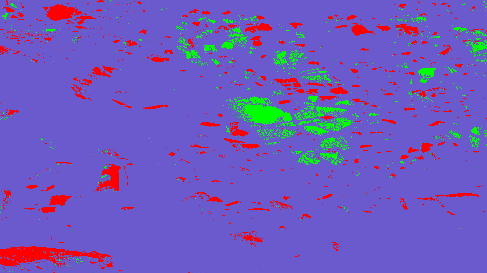

# Segmentation of Mars Terrain Using Classical Computer Vision Techniques

## Dataset

|  | 
|:--:| 
| *Detailed Panorama of Mars' Jezero Crater Delta* ([#1][i1]) |

[i1]: https://mars.nasa.gov/resources/26978/detailed-panorama-of-mars-jezero-crater-delta/

## Steps followed

-  Segment sand using Thresholding
-  Extract the rocks from the image
-  Edge detection for identifying rocks and bedrocks
-  Segmenting rocks and bedrocks with KNN
- Segmenting rocks and bedrocks
  - Superimposing with contour
  - Superimposing with KNN
-  Final result

## Input image

## Output image

> Run the main.ipynb file to visualize the results
